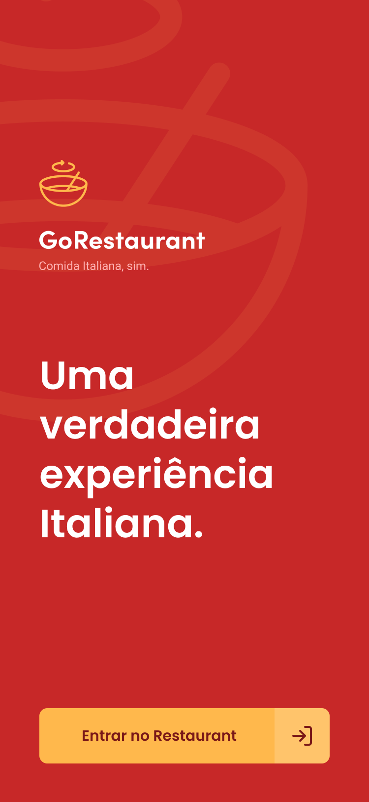
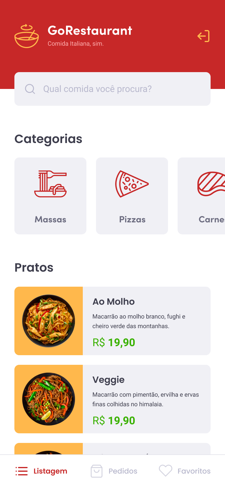
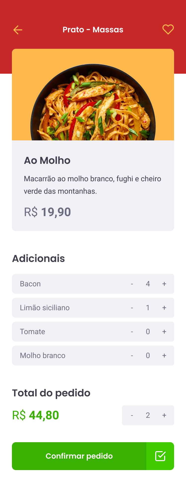

# GoRestaurant

  
  

## Prints

#

## Short description

Simple delivery application.

## 💻 Project

Using Centext-API for state management, styled components to create a stylized css.

## 🚀 Technology

This project was developed with the following technologies:

- [TypeScript] (https://www.typescriptlang.org/)
- [ReactNative] (https://reactnative.dev/)
- [Styled Components] (https://styled-components.com/)

## Starting

1. Clone this repo using `git clone git@githubcom:marceloppb/GoRestaurant_Mobile.git`
2. Move to the appropriate directory: `cd GoRestaurant_Mobile`  
3. Run `yarn` to install dependencies  
4. Run `yarn start` to start locally  

## Licença

Este projeto está licenciado sob a Licença MIT - consulte a página [LICENSE] (https://opensource.org/licenses/MIT) para obter detalhes
